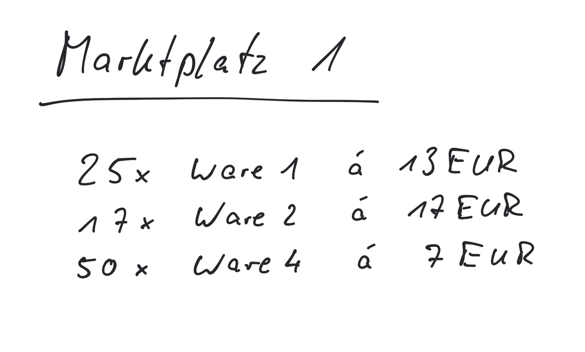
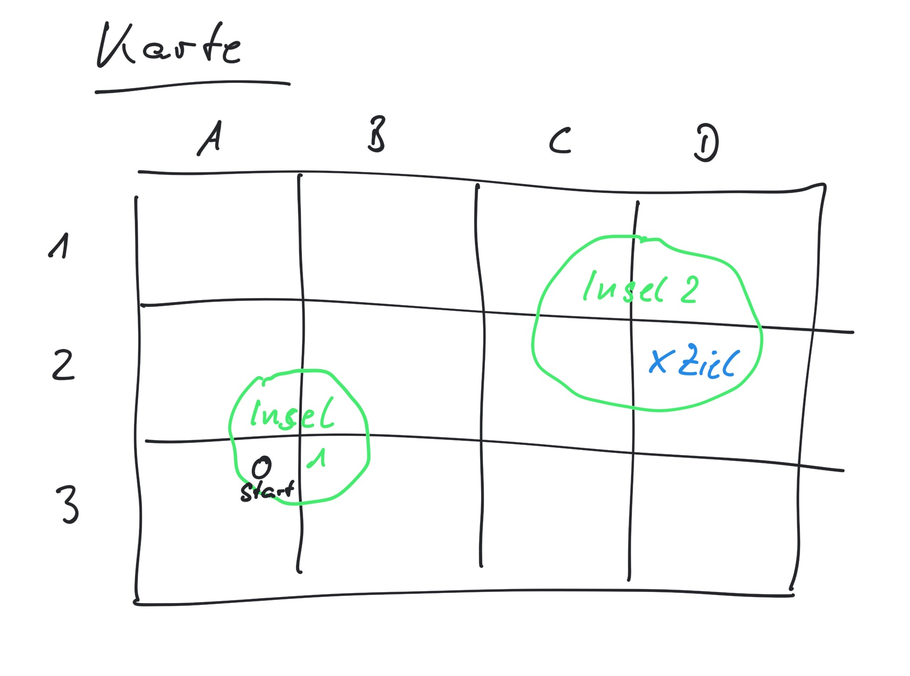

Informatik - Programmierung - bilder/programmierung.jpg
---
## Spiele entwickeln

Wir lernen zu programmieren um zu automatisieren - und lästige Aufgaben nicht mehr von Hand erledigen zu müssen. Das kann auch Aufgaben aus dem Schulalltag einschließen ;-). Die Programmierung ist nur ein Werkzeug. Nebenbei lernen wir in der Informatik auch, es effizient und effektiv einzusetzen.

<iframe src="https://h5p.org/h5p/embed/619" width="1091" height="645" frameborder="0" allowfullscreen="allowfullscreen"></iframe>

In diesem Kurs entwickeln wir eine Wirtschaftssimulation und ein Adventure und finden dabei einen Einstieg in Datenstrukturen, Modellbildung und Programmierung. Das Ergebnis des ersten Teils/Halbjahres ist ein Programm das am PC in Eingabeaufforderung/Terminal läuft. Im zweiten Teil wird das gleiche Programm als App für Mobilgeräte umgesetzt nach dem Muster Model-View-Controller.

### Quiz

### Wirtschaftssimulation

Das erste Programm wird ein Spiel zum Handeln mit Waren, bei dem man nach X Tagen so viel Geld wie möglich verdienen muss.

* Kaufen und Verkaufen von Waren
* Schwankungen der Preise
* Mehrere Orte zum Handeln
* Ziel: Nach X Tagen max. Profit

### Adventure

Als zweies Programm wir ein Adventure entwickelt, bei dem man sich durch verschiedene Szenen bewegt, Gegenstände sammeln und Aufgaben lösen muss.

* Bewegen zwischen Szenen im Raster
* Sammeln von Gegenständen
* Lösen von Aufgaben
* Ziel: Eine (sehr!) kurze Geschichte erfolgreich lösen

### Weitere Beispiele/Aufgaben

* Zahlenraten
* [Türme von Hanoi](https://github.com/axel-klinger/groovy-hanoi)
* [TicTacToe](https://github.com/axel-klinger/groovy-tictactoe)
* [Galgenraten](https://github.com/axel-klinger/groovy-hangman)
* [Adventure](https://github.com/axel-klinger/groovy-adventure)
* [Kartensppiel](https://github.com/axel-klinger/groovy-karten)
* [Wirtschaftssimulation](https://github.com/axel-klinger/groovy-handel)

---
## [BEISPIEL hanoi](https://raw.githubusercontent.com/axel-klinger/groovy-hanoi/master/README.md)
## [Aufsetzen der Entwicklungsumgebung  für PC Programme](setup-dev-groovy.md){bilder/hello.jpg}
## [Erste Programmierbeispiele](prog-intro.md){bilder/korb.jpg}
## [Grundlagen der Programmierung](prog-basics.md){bilder/alpha.png}
## [Modell der Wirtschaftssimulation](modell-ws.md){bilder/modell.jpg}
## [Modell des Adventures](modell-adv.md){bilder/modell.jpg}
## [Aufgaben](aufgaben.md){bilder/aufgabe.jpg}
